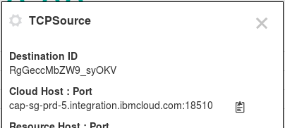

---

copyright:
  years: 2015, 2021
lastupdated: "2021-06-07"

subcollection: StreamingAnalytics

---

<!-- Attribute definitions -->
{:new_window: target="_blank"}
{:shortdesc: .shortdesc}
{:codeblock: .codeblock}
{:screen: .screen}
{:note: .note}

# Connect to enterprise data using {{site.data.keyword.SecureGateway}}
{: #connect_secure_gateway}

_This tutorial requires a paid instance of the {{site.data.keyword.SecureGateway}} service. If you don’t have a need for {{site.data.keyword.SecureGateway}} beyond running this tutorial, you may just want to read the instructions below to understand the capabilities of {{site.data.keyword.SecureGateway}} and the details of using it with the {{site.data.keyword.streaminganalyticsshort}} service._
{:note .note}

## Introduction
{: #introduction}

One of the key challenges in running analytic applications in the cloud is how to securely connect to on-premise data sources (and sinks) that are behind an enterprise firewall.  Real-time analytic applications running in the {{site.data.keyword.streaminganalyticsshort}} service in IBM Cloud may ingest data from sources all over the world, but when these data sources are behind an enterprise firewall, action must be taken to enable connectivity to these services, and to ensure that data is transferred securely across these connections.  In many cases, the {{site.data.keyword.SecureGateway}} service can be used to address this challenge.  {{site.data.keyword.SecureGateway}} will establish network tunnels through the respective firewalls to specific enterprise destinations, enabling {{site.data.keyword.streaminganalyticsshort}} sources and sinks to securely access on-premises data in real-time while maintaining enterprise security and data management practices.

**Attention:**  _To ensure that you comply with your company or corporate security policies, consult your Chief Information Security Officer before you create or install a {{site.data.keyword.SecureGateway}} with the intention of making internal applications or data available to IBM Cloud through the {{site.data.keyword.SecureGateway}} service.  
_

## Overview
{: #overview}

The diagram below depicts the general {{site.data.keyword.SecureGateway}} use case.  An application (labeled “Bluemix Application”) is shown running in the IBM Cloud.  That application needs to access a data resource (labeled “On-prem Resource”) that is not in the cloud.  It is located on-premise, behind an enterprise firewall.  {{site.data.keyword.SecureGateway}} componentry (service/client) shown in the diagram facilitates secure connections between the cloud application and the on-prem resource.  See the [{{site.data.keyword.SecureGateway}} documentation](/docs/SecureGateway/secure_gateway.html) for more details about how {{site.data.keyword.SecureGateway}} accomplishes secure connections.

This tutorial provides a set of sample apps and instructions that allow you to run this general {{site.data.keyword.SecureGateway}} use case.  The figure below provides more detail about the exact scenario you will run:

- The cloud application you will run in this use case is a sample Streams Processing Language (SPL) application that you will run in the {{site.data.keyword.streaminganalyticsshort}} service in IBM Cloud.
- The on-prem resource is a Java program that sends and receives data to/from the Streams application.

In the remainder of this article, the term **enterprise system** will be used to refer to the system within your on-premise network where you will run the sample Java application.
{:note .note}

### Prepare your enterprise system
{: #prepare_enterprise}

There are two prerequisites for your enterprise system to run this tutorial:

- Install the {{site.data.keyword.SecureGateway}} Client – {{site.data.keyword.SecureGateway}} provides multiple options for running its client, however the Docker option is used in this tutorial. To install the docker client refer to the first part of the [docker client install instructions,](/docs/SecureGateway/securegateway_install.html#installing-the-client) but stop after executing the first command which performs the docker pull. Subsequent client setup tasks will be called out explicitly later in the tutorial.
- Java 1.7 or later – If your system does not have Java installed, download and install it from [IBM Java SDK](https://www.ibm.com/support/pages/java-sdk-downloads) or [Oracle](https://www.oracle.com/java/index.html)

### Download the sample apps package
{: #download_samples}

The samples package contains application code that you will run in on your enterprise system and in your {{site.data.keyword.streaminganalyticsshort}} instance in the cloud. Download [the samples package](https://ibm.biz/StreamsIntegrationSamples) and extract its contents.

### Verify the ports you will be using on your enterprise system
{: #verify_ports}

Run the Java app from the samples package in test mode to verify the ports you will be using for this tutorial. From a command line in the **StreamsIntegrationSamples/TcpServerSockets/bin** directory, run:

`java samples/TcpServerSockets test 8080 8082 10`

By specifying “test” as the first argument, the application will run in a test mode where its uses the ports specified locally. This will verify that the ports are available on your system to use in this tutorial. If you see output similar to the image below, continuing for 10 dice rolls, ports 8080 and 8082 can be used for the tutorial. If these ports are not available, run the Java application in test mode using other ports until you find two available ports on your system.

### Create your {{site.data.keyword.SecureGateway}} instance
{: #create_secure_gateway_instance}

Log into the [IBM Cloud web portal](https://cloud.ibm.com/) and create an instance of the {{site.data.keyword.SecureGateway}} service from the [{{site.data.keyword.SecureGateway}} catalog page](https://cloud.ibm.com/catalog/services/secure-gateway).  

Because this tutorial uses two gateway destinations, it requires that you select the “Professional” price plan, which is not free.  As stated at the beginning of this article, if you don’t have an immediate need to use {{site.data.keyword.SecureGateway}} you can choose instead to just browse the instructions.
{:note .note}

After selecting the Professional price plan, press the “Create” button to create your {{site.data.keyword.SecureGateway}} instance.

### Add a gateway
{: #add_gateway}

After creating your {{site.data.keyword.SecureGateway}} instance in the previous step, your browser will display the Service Gateway Dashboard for your instance. Next,

- Click on the “+” in the Add Gateway box near the bottom of the dashboard.
- Enter “TCPSockets” for the name of your gateway. (Leave all the other inputs as their default.)
- Click on the “Add Gateway” button to complete this step.

### Add enterprise destinations
{: #add_enterprise_destinations}

In this step you will create two destinations on your enterprise system that map to the on-prem data resources that you need to access from the cloud.  One destination is used for outbound traffic from your enterprise system, the other for inbound traffic.

From your {{site.data.keyword.SecureGateway}} dashboard, repeat the following steps to create two destinations called **TCPSource** and **TCPSink** using their associated host and port combinations from your enterprise system.

- Click on the “Destinations” section on the lower portion of the dashboard.
- Next, click on the “+” icon to create a new destination.
- Choose the Advanced Setup option
- Enter “TCPSource” as the name of the destination.
- Enter the host name of your enterprise system.  (The value shown in the figure below needs to be replaced with an actual value for your enterprise system.  Depending on how the network is configured on your system you may be able to use the host name of your system, the IP address of your system or “localhost”.)
- Enter the first of the two available ports that you chose to use in step 3.
- Choose “TCP” from the drop-down.
- Change the “Resource Authentication” choice to “None”.
- Click the “Add Destination” button at the very bottom of the dialog to create the destination.

Verify that your {{site.data.keyword.SecureGateway}} dashboard displays two destinations at the end of this step.

This tutorial chooses TCP and no resource authentication in the image displayed above to demonstrate a reasonably simple scenario that you can use to get {{site.data.keyword.SecureGateway}} running with {{site.data.keyword.streaminganalyticsshort}}.  But {{site.data.keyword.SecureGateway}} offers several protocol options, and for each of these there are multiple ways that you can configure authentication and control access.  Ultimately, you will want to design an approach that meets the security needs of your overall application, and then configure the options in {{site.data.keyword.SecureGateway}} to implement your design.
{:note .note}

### Start the {{site.data.keyword.SecureGateway}} client on your enterprise system
{: #start_secure_gateway}

- Click on the “Clients” section on the lower portion of the dashboard.
- Next, click on the “+” icon in the Connect Client box.
- Select Docker in the upper portion of the window that pops up (shown below).
- Copy the complete docker run command displayed in the window.

- Paste the docker run command into the same command-line session where you installed the {{site.data.keyword.SecureGateway}} client in step 1, but don’t run it yet.
- Because our Java sample application is bound to localhost, you’ll need to add another option to the docker run command that you just pasted. Add **–net=”host”** to the command right after the word “run” (separated by a space).  See an example of the the modified command in the image below.
- Verify that the output of the docker run command is similar to the output below, making sure “The {{site.data.keyword.SecureGateway}} tunnel is connected” message is present.

### Authorize your destinations to their target host and port
{: #authorize_destinations}

In this step, we authorize the {{site.data.keyword.SecureGateway}} client to communicate to the two host and port combinations that the destinations target.  In the command-line session running the {{site.data.keyword.SecureGateway}} client:

- Run “acl allow SourceHost:8080”, substituting your actual enterprise host name (or IP address) and the first available port that you identified in step 3.
- Run “acl allow SinkHost:8082”, substituting your actual enterprise host name (or IP address) and the second available port that you identified in step 3.
- Run “show acl” to verify that the entries were added successfully.

### Note the generated host/ports from the destinations
{: #generated_hosts_and_ports}

{{site.data.keyword.SecureGateway}} generates host and port combinations for each destination that you create. These host and port combinations are not the host names and ports that are behind your enterprise firewall. These generated hosts and ports are what services like {{site.data.keyword.streaminganalyticsshort}} in IBM Cloud use to establish connections into your enterprise via {{site.data.keyword.SecureGateway}}. In this step, you will copy the generated host and port for each of the destinations that you have created.

- Click on the “Destinations” section on the lower portion of your {{site.data.keyword.SecureGateway}} dashboard.
- Click on the gear icon within your TCPSource destination to display its properties.
- Copy the values displayed under the “Cloud Host:Port” heading for use in step 12
- Click on the gear icon within your TCPSink destination to display its properties.
- Copy the values displayed under the “Cloud Host:Port” heading for use in step 12

### Create your {{site.data.keyword.streaminganalyticsshort}} instance
{: #create_streaming_analytics_instance}

If you already have a {{site.data.keyword.streaminganalyticsshort}} instance in IBM Cloud, then no further action is required to complete this step.

If you don’t have a {{site.data.keyword.streaminganalyticsshort}} instance, Log into the [IBM Cloud web portal](https://cloud.ibm.com/) and create an instance of the {{site.data.keyword.streaminganalyticsshort}} service from the [{{site.data.keyword.streaminganalyticsshort}} catalog page](https://cloud.ibm.com/catalog/services/streaming-analytics). Any price plan, including Lite, is sufficient to run this tutorial.

### Launch the Streams console
{: #launch_streams_console}

To prepare to run the {{site.data.keyword.streaminganalyticsshort}} application that will connect to your enterprise data:

- Click on your {{site.data.keyword.streaminganalyticsshort}} instance in IBM Cloud to bring up the {{site.data.keyword.streaminganalyticsshort}} dashboard.
- Check the status of the instance. If the dashboard indicates that the instance is stopped, press the “Start” button.
- Next, click the “Launch” button to launch the {{site.data.keyword.streaminganalyticsshort}} console.

### Run the sample Streams app that will connect to your enterprise data
{: #run_sample_streams_app}

In this step, you will run a sample {{site.data.keyword.streaminganalyticsshort}} application that will initiate connections to you enterprise system via {{site.data.keyword.SecureGateway}}.  Two connections will used, one which will receive data from the enterprise data source, the other that will send data back to the enterprise.

- From the {{site.data.keyword.streaminganalyticsshort}} console that you launched in the last step, click on the “Submit Job” task located near the upper left corner.
- Select “Upload an application bundle file from the local file system” and click Browse.
- Navigate to the where you extracted the samples package and into the directory **StreamsIntegrationSamples/TcpClientSockets**. Select the **sample.TcpClientSockets.sab** file and click the “Submit” button.
- A dialog will appear prompting you for parameters required by the TcpClientSockets sample application. Fill in these 4 fields using the generated hosts and ports you copied in step 9\. Break apart each copied value into its host value and its port value, to fill in 2 parameters.
- Click “OK” to submit the job.

Once the job is submitted and appears in the {{site.data.keyword.streaminganalyticsshort}} console, you can proceed to the next step.  After this job begins to run, you may see messages start to fly by in your {{site.data.keyword.SecureGateway}} docker client.  These are attempts by the {{site.data.keyword.streaminganalyticsshort}} application (TCP client) to connect to the Java application (TCP server) that is not running yet.

### Run the sample Java app to listen for connections
{: #run_sample_java_app}

In this step, you will again run the Java app from the samples package, but this run will not be in test mode. Instead, this run of the Java app will listen for remote connections from {{site.data.keyword.streaminganalyticsshort}} in the cloud.

This run of the Java app needs to be performed in its own command-line session.  Do not use the {{site.data.keyword.SecureGateway}} client command line session for this.
{:note .note}

From a command line in the **StreamsIntegrationSamples/TcpServerSockets/bin** directory, run:

`java samples/TcpServerSockets 8080 8082 100`

Once the Java app is started, you should see output similar to the image below.  Data from each of the numbered dice rolls is sent to the {{site.data.keyword.streaminganalyticsshort}} application for analysis.  The results of the analysis are sent back to the Java application and displayed in its output.

In addition to the Java app output connection activity should be visible in the {{site.data.keyword.SecureGateway}} client Docker session, and data flow should be visible in the Streams Console.

### Wrapup
{: #wrapup}

Once the Java application TcpServerSockets reaches the specified number of rolls, the Source and Sink Sockets will be closed and the application ends.

When you are finished running the tutorial, make sure that you cancel the samples.TcpClientSockets Streams job using the {{site.data.keyword.streaminganalyticsshort}} console.
{:note .note}

## Related links
{: #related_links}

- Download the samples used in this tutorial [here](https://ibm.biz/StreamsIntegrationSamples).
- [{{site.data.keyword.SecureGateway}}: everything you ever wanted to know](https://www.ibm.com/cloud/blog/secure-gateway-everything-ever-wanted-know)

