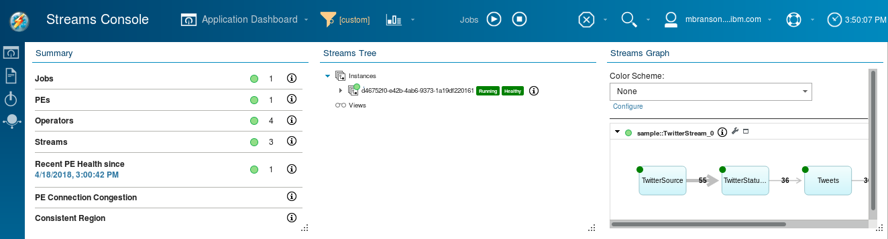
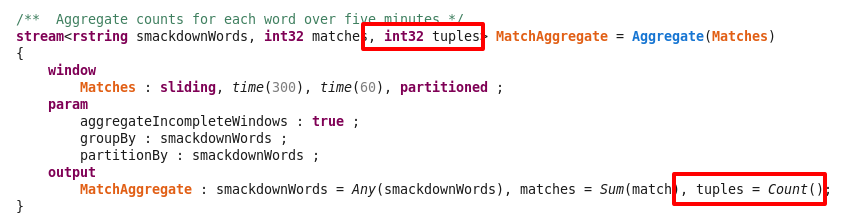
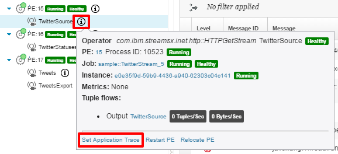
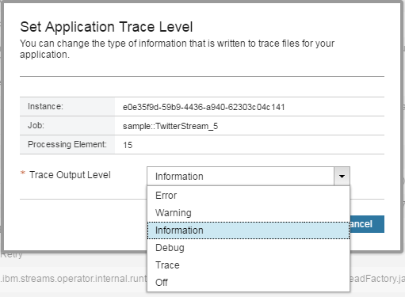

---

copyright:
  years: 2015, 2020
lastupdated: "2020-09-22"

subcollection: StreamingAnalytics

---


<!-- Attribute definitions -->
{:new_window: target="_blank"}
{:shortdesc: .shortdesc}
{:codeblock: .codeblock}
{:screen: .screen}
{:pre: .pre}
{:tip: .tip}
{:note: .note}


# {{site.data.keyword.streaminganalyticsshort}} Development Guide
{: #development_guide}

Use the IBM Streams Quick Start Edition (QSE) to build, submit and monitor a streaming analytics application using the {{site.data.keyword.streaminganalyticsshort}} service on IBM Cloud.
{:shortdesc}

## Before You Begin
{: #readmefirst}

This development guide applies to Streams applications that are compiled in the Streams Studio IDE or compiled by you using the <code>sc</code> command. It does not apply to applications where the compilation is performed for you in the cloud by other development tools, such as:

- Streams Flows (in Watson Studio)
- IBM Streams Runner for Apache Beam
- Python/DSX notebooks (without a local Streams install)


_If you are using {{site.data.keyword.streaminganalyticsshort}} via one of the three development tools listed above, please refer to the documentation associated with those tools as your development guide._

## Introduction
{: #introduction}

{{site.data.keyword.streaminganalyticsshort}} is an IBM Cloud service built upon the IBM Streams technology. Streams is an advanced analytic platform allowing user-developed applications to quickly ingest, analyze, and correlate information as it arrives from a wide variety of real-time sources. The {{site.data.keyword.streaminganalyticsshort}} service gives you the ability to deploy Streams applications to run in the IBM Cloud.

This guide will help you through the processes for building, submitting and monitoring a streaming analytics application using the {{site.data.keyword.streaminganalyticsshort}} service on IBM Cloud. The guide assumes that you are already familiar with Streams application development and are now ready to start developing for the cloud. If you are not already familiar with Streams application development you should first check out the out this [brief introduction to IBM Streams](https://ibmstreams.github.io/streamsx.documentation/docs/spl/quick-start/qs-0/).

This guide will help you download and setup the IBM Streams Quick Start Edition (QSE) for Docker to use as your development environment for Streams applications. In addition, this guide provides a sample application that you can build in QSE and run in the cloud.

If you have questions or difficulty following the steps in this guide, please add a comment at the bottom of the article so we can address your concerns. Also, if there are topics related to development that are not covered here, comments are welcome.

## Setting Up Your Streams Development Environment
{: #setting-up-streams}

{{site.data.keyword.streaminganalyticsshort}} in IBM Cloud is running IBM Streams version 4.3 on CentOS 7.4.

In order to compile Streams applications to deploy to an instance in the cloud, you need IBM Streams version 4.0.x, 4.1.x, 4.2.x or 4.3.x installed on a RHEL or CentOS 7.4 x86_64 system. If you have a compatible installation of IBM Streams available to you, you can use that for your development environment and skip to the “Introducing Our Sample Application” section further down in this document.

If you do not have a compatible installation of IBM Streams, you can set up the IBM Streams Quick Start Edition (QSE) and use it as your development environment for the cloud.

### IBM Streams Quick Start Edition (QSE) for Docker Setup
{: #setup-steps}

Streams QSE is now available through dockerhub. To run the QSE in Docker, follow the <a href="https://hub.docker.com/r/ibmcom/streams-qse">IBM Streams QSE setup instructions</a> for the OS you are using for your development environment.

(Alternatively, if you want to run the Streams QSE on Linux native (without Docker) visit the <a href="https://www-01.ibm.com/marketing/iwm/iwm/web/preLogin.do?source=swg-ibmistvi" target="_blank">IBM Streams Quick Start Edition download site</a> for instructions and the set of available downloads.)

## Introducing Our Sample Application
{: #introducting-sample}

The sample application used for illustration in this guide accesses Twitter to get a live sample feed of tweets.

The sample application is actually comprised of two SPL applications. The first application, **TwitterStream**, accesses the live Twitter feed and exports a stream of tweets for use by other SPL applications. In the following streams application graph the first operator reads from an HTTP stream, the second operator filters out any messages that are not Twitter statuses, the third operator adds a count to each tuple. The final operator exports the stream for use by other jobs in the streams instance.


The second application, **Smackdown**, produces a score for each word in a list of words. At job submission time you specify a list of words participating in the smackdown. For each “opponent” word in the smackdown, the application calculates the number of Twitter statuses containing the search word. Every minute, the application produces a running score for the previous five minutes. In this application, the first operator imports the stream of tweets that is exported by the TwitterStream application. The second operator calculates a match score for each opponent in the smackdown. The third operator keeps a running aggregation of the number of matches for each opponent, producing a score every minute. The last operator prints the results to its standard output, also known as the process console messages which you will view later.


Structuring this sample into two separate streams jobs using export and import allows us to use a single connection to the Twitter source while being able to run multiple smackdowns using the same stream of tweets. You will import the sample source into Streams Studio in order to compile the two applications.

## Downloading the Sample Application Source
{: #downloading-sample}

The instructions assume you will be using Firefox within the IBM Quick Start Edition for Docker to download the zip file. If you download the source zip file directly to your host computer (e.g. Windows), you will need to copy it to the IBM Quick Start Edition for Docker.
{:note .note}

[Download Sample Source Files](https://streams-github-samples.mybluemix.net/?get=ReadAndStoreData%2FTwitterSmackdown)

Unzip the downloaded file which will create a directory called `TwitterSmackdown`.

## Compiling the Sample in Streams Studio
{: #compiling-sample}

IBM Streams applications are written in Streams Processing Language (SPL). SPL applications are compiled into a Streams Application Bundle (SAB) which can be submitted as a job using the {{site.data.keyword.streaminganalyticsshort}} service in IBM Cloud. You can use Streams Studio to edit and compile your applications. Streams Studio is an Eclipse-based development environment.

Following the steps in this section, you will first compile and run the sample application in IBM Cloud. Later, you will use Streams Studio to modify the application, re-compile and run the application again.

Within your running IBM Quick Start Edition for Docker, start Streams Studio from the menu: **Applications-&gt;Favorites-&gt;Streams Studio (Eclipse)**.

1. Click **OK** to accept the default workspace name, <code>/home/streamsadmin/workspace</code>. When studio starts up there are no projects defined yet.
1. To import the sample click **File-&gt;Import**.
1. In the import dialog expand **IBM Streams Studio**, select **SPL Project**, and click **Next**.
1. For the **Source** use the **Browse** button to navigate to the unzipped TwiterSmackdown folder. Select the TwitterSmackdown application in the list.
1. In the **Project Name** column of the list, change the project name from **TwitterSmackdown** to **Smackdown**.
1. Click **Finish** to complete the import operation.


Studio will import the project into the workspace. By default, Studio rebuilds the workspace when files are created or modified. It might take a couple minutes for the applications to compile. You can see the status of the build in the lower right status bar of studio. When the build finishes, the project explorer should look like this.


Expanding the Resources folder and subfolders as shown in the figure below reveals the compiled Streams Application Bundle (SAB) files. These bundles are now ready to submit to {{site.data.keyword.streaminganalyticsshort}} on IBM Cloud.


For future reference the full path names for the two bundles are:

```
/home/streamsadmin/workspace/Smackdown/output/sample.Smackdown/BuildConfig/sample.Smackdown.sab
/home/streamsadmin/workspace/Smackdown/output/sample.TwitterStream/BuildConfig/sample.TwitterStream.sab
```

You’ll use those paths later to submit the jobs on IBM Cloud.

## Creating Twitter Application Credentials
{: #creating-twitter-app}

The TwitterStream SPL application uses a Twitter streaming API to get a live sample stream of twitter updates. You need to create authorization credentials for the application to use to connect to the Twitter API.

1. Go to <a href="https://apps.twitter.com/" target="_blank" rel="noopener noreferrer">apps.twitter.com</a>.
1. Log in to your Twitter account (or sign up for Twitter).
1. On the Application Management page, click the **Create New App** button.
1. Enter a **Name** and **Description** for your application
1. Enter a **Website** for your application. Twitter requires you to enter a valid HTTP url, for example, _https://www.mydomain.com/_
<div></div>
1. Click the **Yes, I agree** checkbox to accept the Twitter Developer Agreement.
1. Click the **Create your Twitter application** button. After the application is created, the application details page is displayed.
1. Switch to the **Keys and Access Tokens** tab.
1. Click the **Create my access token** button.
<div></div>
1. Copy and paste the following values for later.
    - **Consumer Key (API Key)**
    - **Consumer Secret (API Secret)**
    - **Access Token**
    - **Access Token Secret**


These four values will be used as submission-time parameters when submitting the TwitterStream job to {{site.data.keyword.streaminganalyticsshort}} on IBM Cloud.

## Creating a {{site.data.keyword.streaminganalyticsshort}} Service Instance on IBM Cloud
{: #creating-streaming-service}

If you have already created an instance of the {{site.data.keyword.streaminganalyticsshort}} service, you can skip this section. If you still need to create one, follow the steps below:

1. Go to <a href="http://cloud.ibm.com/" target="_blank" rel="noopener noreferrer">cloud.ibm.com</a>.
1. Log in to your IBM Cloud account (or create an account).
1. Open the **Catalog** link.
1. Browse for and select the **{{site.data.keyword.streaminganalyticsshort}} service**.
<div></div>
1. The {{site.data.keyword.streaminganalyticsshort}} Catalog page will be displayed
<div></div>
1. Enter a **Service name**, or use the default name provided.
1. Select one of the service plans
<div></div>
{: caption="Price plan section of the {{site.data.keyword.streaminganalyticsshort}} catalog displaying a partial list of the price plans." caption-side="bottom"}
1. Click **Create** to create an instance of the service. This provides you with your own Streams instance, started and ready to run Streams applications.
1. The {{site.data.keyword.streaminganalyticsshort}} service dashboard will be displayed.
<div></div>


You can use the **START** and **STOP** buttons on the service dashboard to start and stop the service. While started, you can submit jobs to the service using the Streams Console.

## Submitting Your Jobs to {{site.data.keyword.streaminganalyticsshort}} on IBM Cloud
{: #submitting-jobs"}

On the {{site.data.keyword.streaminganalyticsshort}} service dashboard use the **LAUNCH** button to start the Streams Console, which will open in a new window or tab. The console will open displaying an Application Dashboard which allows you to submit, monitor and cancel your jobs in the {{site.data.keyword.streaminganalyticsshort}} service.


Recall that the compiled application bundles were at these paths in the IBM Quick Start Edition for Docker:

```    
/home/streamsadmin/workspace/Smackdown/output/sample.Smackdown/BuildConfig/sample.Smackdown.sab
/home/streamsadmin/workspace/Smackdown/output/sample.TwitterStream/BuildConfig/sample.TwitterStream.sab
```

You will be submitting jobs using these bundles. The instructions here assume you are using Firefox within the QSE to submit the jobs. If you are using a browser on your host computer (e.g. Windows), you will need to transfer these bundle files from the QSE to your host computer before you continue.

1. Click the **Submit Job** button in the console tool bar.
<div></div>
1. In the Submit Job dialog the **Instance** is pre-selected for you. For the **Application bundle file** use the Browse button to navigate to and select the _sample.TwitterStream.sab_ file.
1. Click the **Configure** button. 
<div></div>
1. The bundle file will be be uploaded and you will be prompted for additional options as shown in the image below.
1. Take the default values for the options near the top of the dialog.
1. For the **Submission-time parameters**, enter the four values for Twitter application credentials that you created earlier. The asterisk preceding the name of a submission-time parameter indicates there is no default value, so you are required to enter a value to continue.
<div></div>
1. Click the **Submit** button.

The job is submitted to the {{site.data.keyword.streaminganalyticsshort}} instance. You should see a couple of pop-up messages appear briefly showing the job submission status. The Streams Console refreshes automatically in the background. After a short period of time, the job will appear in the **Summary**, **Streams Tree**, and **Streams Graph** views along the top of the Application Dashboard. These views will stay updated to show the current status of the jobs running in your streams instance.



At this point there is just one job running, TwitterStream, as shown in the Streams Graph view. The graph shows the operators and connections between them. When a new job is starting up some operators might be decorated with yellow triangles and the connections might be dashed lines, indicating that the job is not yet completely started and healthy. When the job is fully up and running the operators are decorated with green circles and the connection lines are solid, indicating that the job is fully healthy.

If you want to focus on a particular view in Streams Console, hover over the card title and a tool bar will appear. You can click on the Max icon to maximize that card within the dashboard. When maximized click the icon again to restore back the the tiled layout.
{:tip .tip}


## Monitoring your job
{: #monitoring-job}

### Monitoring tuple flows
{: #monitoring-tuple-flow}

The number appearing in the connection line is the most recent number of tuples per second flowing between the two operators. If there are no numbers on the connections there have been no tuples flowing recently between the operators. If you hover the mouse over an object in the **Streams Graph** view, a pop-up will show details for that object and, in some cases, a menu of actions for that object.


In this case there were 62 tuples per second the last time metrics were refreshed. Twitter’s sample stream is a small subset of all Twitter statuses. The flow rate can vary but usually seems to be several dozen per second. The metrics shown at the bottom of the pop-up are the cumulative amounts.

### Submitting the Smackdown job
{: #submitting-smackdown-job}

At this point you just have the one job producing a stream of tuples. When the tuples get to the TweetsExport operator they are discarded because there is no job connected to that stream. (If for some reason your job does not have any data flowing, the most likely problem is correctly specifying the Twitter authorization credentials in the submission-time parameters. The section on viewing trace messages below will explain how to investigate.)

It’s time to submit the second job, Smackdown, to consume the stream of tuples produced by the first job. Follow the job submission steps above again to submit the **sample.Smackdown.sab** file. When prompted for the **opponents** submission-time value enter _red,green,blue_ for three words competing in the smackdown. You can use three celebrities, band names, team names, etc.


In a few moments the second job will be started and the Streams Graph view will refresh to show the TweetsExport operator in the TwitterStream job being connected to the TweetsImport operator in the Smackdown application.


### Viewing Sample Data in a Dynamic View
{: #viewing-sample-data}

You can create a view on the tuples flowing across any of the connections in the streams graph to monitor a sample of the data that is flowing between two operators.

1. Hover over the connection between the **MatchAggregate** and **AggConsole** operators.
1. Click **Create Dashboard View.**
<div></div>
1. Switch to the **Buffer** tab.
1. Change **Tuples/sec Throttle** to 3. The MatchAggregate operator produces one tuple for each smackdown opponent every sixty seconds. Changing this throttle from 1 to 3 will include the most recent score for each entry in our word list.
1. Click **OK** to create the new view.
<div></div>

A new data visualization view will be added to the Application Dashboard. This view definition will remain after you log out and log back in to the console.


The image above indicates At this point, “blue” is winning the smackdown. The **matches** column shows the number of tweets in the last five minutes that contain each of the smackdown opponent words.

### Displaying a Line Chart of the Data
{: #displaying-line-chart}

You can also create a line chart from a data visualization view.

1. In the the data visualization view, click the **Create Time Series Chart** icon.
<div></div>
1. On the **Chart** tab, increase the **Number of snapshots** to 30, so the chart shows an interesting number of points.
<div></div>
1. Switch to the **Categories** tab.
1. For **Choose line categories from**, select _Multiple attributes values_.
1. For **Lines measured against this attribute**, select the _matches_ attribute.
1. For **Plot lines for each unique value of**, select the _smackdownWords_ attribute.
1. Click **OK** to create the chart.
<div></div>

A new line chart view will be added to the Application Dashboard. This view definition will remain after you log out and log back in to the console.

If you hover over one of the lines in the chart, a status bar will display with the maximum, minimum and median values for that series.


## Canceling Your Job
{: #canceling-job}

In the next section you will enhance the Smackdown application and resubmit the job. But first cancel the existing Smackdown job.


1. Click the **Cancel Jobs** button in the console tool bar.
1. In the Cancel Jobs dialog select the Smackdown application.
<div></div>
1. Click the **Cancel Jobs** button and then click **Yes** when prompted to confirm the job cancellation.

If you have any open data visualization or chart views for a job, those views remain when the job is canceled. You probably want to close those views because no new data will be produced in those views after the job is canceled.
{:tip .tip}

## Enhancing the Sample Application
{: #enhancing-application}

### Adding Additional Function
{: #adding-function}

So far the sample application produces a simple aggregate of the number of tweets that contain our search words. Let’s modify the Smackdown application to calculate the percentage of the tweets containing the search words. To do this you need to:

- Add a new field to the Aggregate operator output schema.<code></code>
- Set the new field in the operator’s output assignments.
- Add a downstream operator to calculate the percentage of tuples that match the search word


You will use the The SPL Editor, a text-based editor that provides language syntax highlighting and context-sensitive assistance.

Returning to studio in the QSE, in the Project Explorer view:

1. Drill down to the **sample::Smackdown** main composite operator.
1. Right click on the operator and select **Open With**, and then **SPL Editor**.
<div></div>
1. Scroll down to the Aggregate operator.
1. Add the new field to the output stream schema:
```cpp
    int32 tuples
```
1. Add the new output assignment: 
```cpp
    tuples = Count()
```
   `Count()` is an output assignment function provided by the Aggregate operator which returns the number of tuples currently in the window.
    


Next, add the following two operator invocations at the end of the composite operator, right before the **config** clause.

```cpp
/** Calculate percent matched */
stream&lt;rstring smackdownWords, int32 matches, int32 tuples, float64 percent&gt; Results = Functor(MatchAggregate)
{
    output
        Results : percent = roundedPercent(matches, tuples);
}

/** Print results for viewing in console log */
() as ResultsConsole = Custom(Results)
{
    logic
        onTuple Results :
        {
            printStringLn((rstring) Results) ;
        }
}
```
{: codeblock}


In the output clause of the above Functor invocation is a call to the function roundedPercent. You need to define that function to calculate the percent. It will round the result to four decimal places. You can define reusable functions in SPL very simply. Add the following function definition to the bottom of the Smackdown.spl source file, after the closing brace so it is outside the scope of the main composite operator.

```cpp
/** Calculate percentage and round to four decimal places */
float64 roundedPercent(int32 x, int32 y) {
return y &gt; 0 ? round(((float64)x * 100.0 / (float64)y ) * 10000.0) / 10000.0 : 0.0;
}
```
{: codeblock}

Save the changes using **File -&gt; Save** or **Ctrl+S**. Streams Studio will automatically rebuild the application based on the changes to the source file.

With these changes made and compiled, submit the Smackdown application again following the same steps used to submit the job before.

### Viewing the New Results
{: #viewing-new-results}

With the new Smackdown job running you can see the two new operators, **Results** and **ResultsConsole**, in the Streams Graph view. Now open a data visualization view on the results with the calculated percentage.


1. Hover over the connection between the **Results** and **ResultsConsole** operators.
1. Click **Create Dashboard View.**
1. Switch to the **Attributes** tab. This tab allows you to select which tuple attributes to be included in the view.
1. Deselect the **matches** and **tuples** attributes so only the **smackdownWords** and **percent** are selected.
<div></div>
1. Switch to the **Buffer** tab.
1. Change **Tuples/sec Throttle** to 3.
1. Click **OK** to create the new view.

The new data visualization view displayed will show you the percent of tweets containing each of the smackdown words.


If you want you can now create a line graph chart with these results following the previous steps for creating a chart.

## Troubleshooting
{: #troubleshooting}

### Viewing Trace Messages
{: #viewing-trace-messages}

For troubleshooting you can see if the operators in your application are logging any messages indicating failures. For example, I submitted the TwitterStream job and I can see that no tuples are flowing through the graph. The most likely explanation is that a source adapter operator is not connecting to its source.

1. Navigate to the **Log Viewer** in the console.
1. Expand the tree view for the **TwitterStream** job to find the PE that contains the **TwitterSource** operator.
1. Switch to the **Application Trace** tab in the log viewer.
1. Click **Load application traces**.
<div></div>


A current snapshot of the trace messages for the operator is loaded with the newest messages shown first. You can see that the operator is receiving an HTTP status code of 401 which means “Not authorized”.


By default only error messages are included in the trace logs. If the error messages don’t seem to have enough detail you can investigate further by adjusting the level of detail being logged. There is a trace level setting for every PE in the job, so you can change the trace level for individual PEs as needed.

1. Return to the tree view in the Log Viewer
1. Hover over the “i” information icon for the operator (or PE)
1. Click the **Set Application Trace Level** action
<div></div>
1. In the Set Application Trace Level dialog change the **Trace Output Level** to _Information_.
<div></div>


The log view does not automatically refresh its contents like the Application Dashboard. Wait a couple minutes for the operator to retry connecting to the server and click the **Reload** link above the log messages.


In addition to the HTTP 401 status code, the operator logged a warning message indicating the error was due to an authentication error. In this case, canceling the job and resubmitting it making sure to correctly copy and paste the Twitter credentials fixed the problem.

If you want to change the trace level for all PEs in the job you can use the **Set Application Trace** action on the menu for the job.
{:tip .tip}

If you need to see detailed trace messages when the PEs are initially starting, you can set the trace level on the job submission dialog.
{:tip .tip}


### Viewing Console Log Messages
{: #viewing-console-messages}

In addition to trace messages, operators can also write messages to the console log, which is the standard output for the process. Unlike tracing, console logging has no levels of messages and the output is completely free-form. The Smackdown application uses a Custom operator to write result messages to the console.

1. In the Streams Console navigate to the **Log Viewer**.
1. Expand the tree view for the **Smackdown** job to find the PE that contains the **AggConsole** operator.
1. Switch to the **Console** tab in the log viewer.
1. Click **Load console messages**

A current snapshot of the trace messages for the operator is loaded with the newest messages shown first. The console will contain the result messages that are printed every minute, one for each search term.


### Downloading All Logs For A Job
{: #downloading-job-log}

You can capture a snapshot of all logs for a job to download to your computer. This can be handy for searching across the logs for a large number operators in a job.

1. Navigate to the **Streams Tree** view in the Application Dashboard.
1. Expand the tree view to the job for which you want to download logs.
1. Hover over the “i” information icon for the job
1. Click the **Download Job Logs** action
<div></div>

A pop-up window should appear showing that a request was made to collect the logs for the job. When the request is complete a gzipped tar file will be download through the browser.

## Additional Resources
{: #additional-resources}

Read more about about some of the special considerations when developing your Streams application for the cloud in [Getting your SPL application ready for the cloud](/docs/StreamingAnalytics?topic=StreamingAnalytics-spl_cloud_ready).

