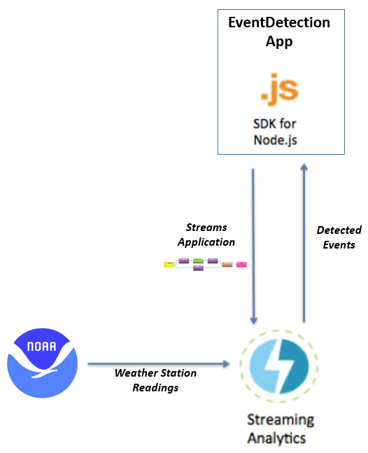
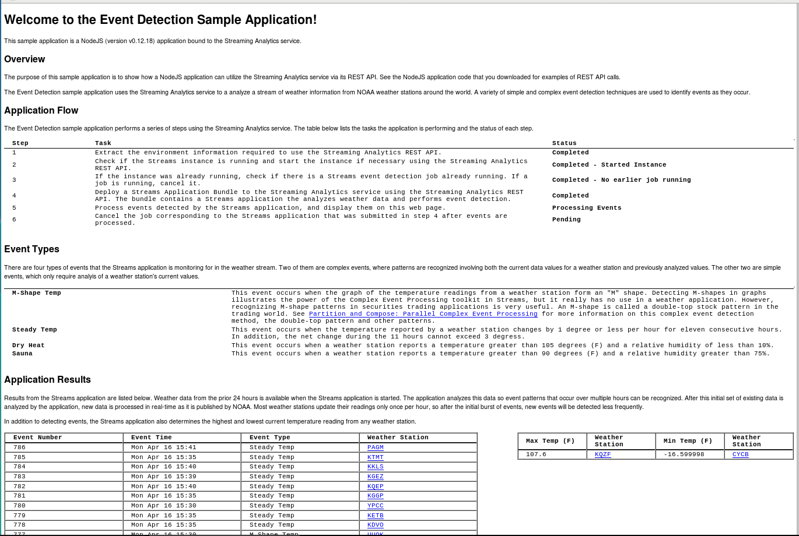
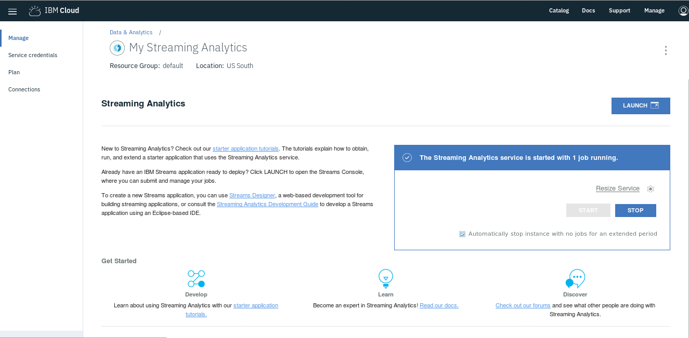
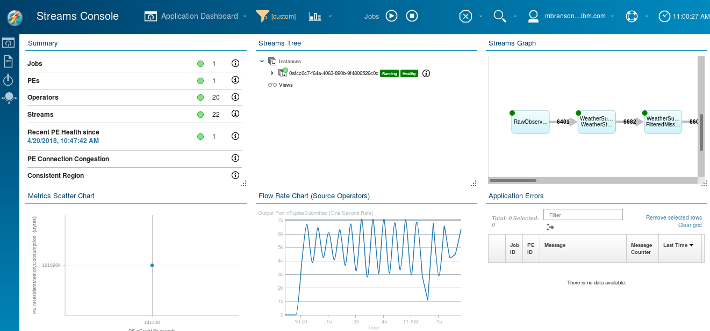
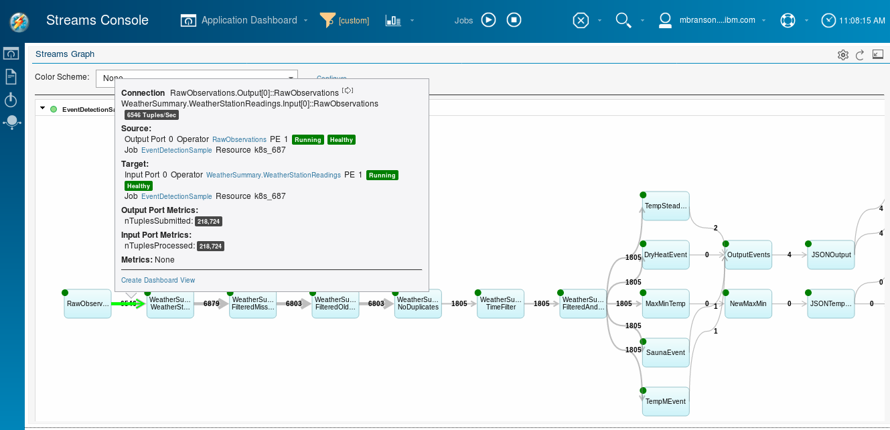
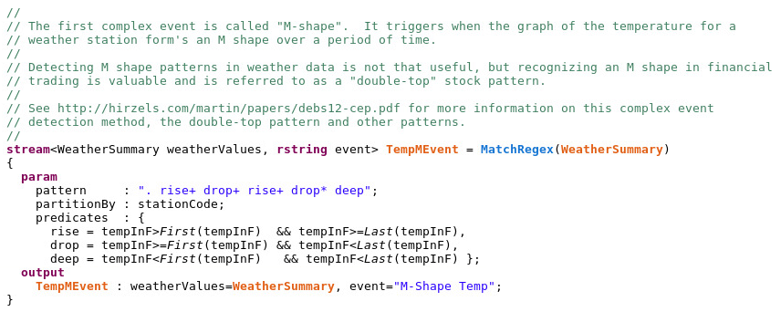
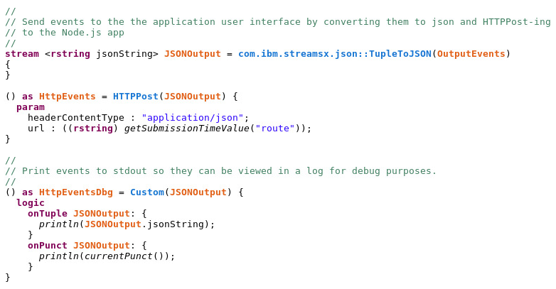

---

copyright:
  years: 2015, 2020
lastupdated: "2020-09-22"

subcollection: StreamingAnalytics

---

<!-- Attribute definitions -->
{:new_window: target="_blank"}
{:shortdesc: .shortdesc}
{:codeblock: .codeblock}
{:screen: .screen}
{:pre: .pre}
{:tip: .tip}
{:note: .note}

# Detect Complex Events in Real-time
{: #detect_events}

Do you want to perform complex event detection on information from real-time data sources and act quickly when events are found? It’s easier than you might think when you use the Streaming Analytics in IBM Cloud. To show how easy, I built a starter app that:

*   Uses the Streaming Analytics service from a Node.js web app in the IBM Cloud
*   Ingests a stream of data into Streaming Analytics
*   Recognizes patterns and detects events in the data stream
*   Sends the results of the analysis to the web app

This tutorial explains how to obtain, run, and extend this starter app, called EventDetection. Here’s a graphical overview of the solution components:

The EventDetection app is implemented via the SDK for Node.js runtime. The app provides a simple web UI to display status and results of the analysis. The Node.js app is bound to an instance of the Streaming Analytics service. The app controls the service via the Streaming Analytics REST API.

Analytics are performed by an IBM Streams application that implements the event detection against a stream of weather data. A Streams application bundle is submitted by the Node.js app to deploy the Streams application to the Streaming Analytics instance running in IBM Cloud.

The data being analyzed is weather data available on the public Internet from the National Oceanic and Atmospheric Administration (NOAA). After the Streams application is deployed into the Streaming Analytics instance, it continuously ingests and analyzes the weather data until the Streams application is stopped.

When the Streams application detects events, they’re sent to the Node.js app for display on the app’s web UI.

NOAA data is available for a certain number of past hours. The application analyzes this past data first and then picks up real-time data as it is published by NOAA. For this reason, the application detects a large number of events right away and then detects events more sporadically, as new data is posted. Most NOAA weather stations post new readings hourly, but some updates might come more frequently.
{:note .note}

## Step 1: Deploy the Sample
{: #deploy_sample}

To run the Event Detection sample, you need to access the [IBM Streams Samples Catalog](http://ibmstreams.github.io/samples/), and find the [EventDetectionV2](https://github.com/IBMStreams/samples/tree/main/QuickStart/EventDetectionV2) sample.

After locating the sample, follow the step-by-step instructions in its README.md file to run the sample.

## Step 2: View the Running Sample
{: #view_running_sample}

The last step of the deployment instructions in the README.md file has you visiting the URL of the Node.js application in your web browser. When you bring up the web app in your browser, you will see a basic web page with the title: **Welcome to the Event Detection Sample Application!** as shown in the figure below.  
The web page is broken up into a few different sections:

*   The **Application Flow** section lists the steps that are being performed by the application and their status.
*   The **Event Types** section defines the types of events the application is detecting.
*   The **Application Results** section displays the events as they are detected. It also displays the highest and lowest temperature currently reported.

## Step 3: Explore the Running Streams Application
{: #explore_streams_application}

1.  In the IBM Cloud web portal, bring up the service dashboard for your Streaming Analytics service. The Streaming Analytics dashboard, shown here, offers tasks to control your instance and links to relevant information: 
2.  Click the **LAUNCH** button on the dashboard to display the Streaming Analytics console. In the image below, the console shows one job running – the Streams application that’s performing the complex event detection:  
    
3.  Maximize the Streams Graph pane in the upper right of the console to show the flow graph of the Streams application. The graph shows the live status of your Streams application as it runs. You can hover over the operators in the graph or the connections between them to get more-detailed information. In the following screenshot, hovering over a connection between the first two operators in the graph displays information about the status of that connection, including the current tuple rate and the total number of tuples that have flowed across the connection. 

This Streams application can show tuple rates of zero for long periods of time.  As mentioned earlier, the weather data stream is “bursty”.  There is a lot of data to process when the app is started, but after that new data becomes available infrequently, so no data is processed in some time periods. To consistently see nonzero tuple rates in the graph, restart your Node.js app and switch over to the Streams graph immediately. Once the job restarts, you’ll see nonzero tuple rates for at least a few minutes as the Streams application processes the initial burst of data.
{:note .note}

## Step 4: Review the Node.js Code
{: #review_nodejs_code}

The EventDetection app is a complete yet simple application that requires no customization to run. To understand the app, examine its code:

1.  Open the app.js file to view the application logic. The code in app.js is organized around six major steps:
    *   **Step 1** – Extract the environment information required to use the Streaming Analytics REST API.
    *   **Step 2** – Check if the Streams instance is running and start the instance if necessary via the Streaming Analytics REST API.
    *   **Step 3** – If the instance was already running, check if a Streams event-detection job is already running. If a job is running, cancel it.
    *   **Step 4** – Deploy a Streams Application Bundle to the Streaming Analytics service by using the Streaming Analytics REST API. The bundle contains a Streams application that analyzes weather data and performs event detection.
    *   **Step 5** – Process events detected by the Streams application, and display them on this web page.
    *   **Step 6** – Cancel the job corresponding to the Streams application after 1,500 events are processed.
2.  Skim the code to identify the where these steps above are performed.
    *   Some of the steps involve calling the Streaming Analytics REST API, making this sample a good example of how to use the API from Node.js.
    *   Step 5 is implemented as a POST handler. The Streams application sends event messages to Node.js using an HTTPPost operator, and the POST handler in the Node.js app parses them and updates the web UI accordingly.

## Step 5: Review the Streams Application Code
{: #review_streams_graph}

The Streams application used is a complete Streams application that requires no customization to run. The source code that you downloaded (or cloned or forked) contains the application’s source code as well as its prebuilt .sab file. To understand the Streams application, examine its code. Below, we look at the details behind two key pieces of the Streams app:

1.  Open the EventDetection.spl file (located in the project’s spl subdirectory). The source code for the application is written in SPL, a language oriented to data streams and operators that act upon them.
2.  Skim the code to locate the operator declarations and compare them to the flow graph that you saw in the Streaming Analytics console. You’ll take a more detailed look at a couple of the operators in the remainder of this section.
3.  Examine the code for one of the operators that detects a complex event. The code snippet below shows an operator called MatchRegex, which is used to detect patterns on a series of data tuples in a stream. The code comments describe the nature of the M-shape pattern that the operator will detect:  
      
    The declaration of the operator defines the pattern that you’re trying to detect by using regular-expression syntax with a set of predicates that are also defined in the operator declaration. The operator looks for the M-shape of the temperature at a weather station based upon the set of values that have been reported by that weather station. This MatchRegex operator consumes the WeatherSummary stream defined earlier in the SPL code and produces a stream called TempMEvent. The operator partitions the weather station’s readings into separate groupings, by the weather station’s ID, and maintains the state necessary to detect the event for each weather station.
4.  Next, examine a sequence of two operators used to send events back to the Node.js app:  
      
    The first operator in the preceding snippet converts a tuple in a stream into a JSON string. This operator consumes a stream called OutputEvents defined earlier in the SPL code and produces a stream called JSONOutput. The next operator, called HTTPPost, consumes the JSONOutput stream and sends the JSON string to the route for the Node.js app via an HTTP POST.

## Step 6: Customize or Extend the Sample
{: #customize_sample}

Now that you’re familiar with the starter app, you can modify the application’s source code to customize it or extend it in any of several interesting ways:

- To make the app run longer, modify the Node.js code in app.js to change the event_target variable’s value from 1500 to a higher number.
- To define a new complex event for the Streams application to detect:
    1.  Update the SPL code to add another MatchRegex operator to the flow to detect a pattern that you want to look for.
    2.  Update the operators after your new MatchRegex operator in the SPL code so that your new event type gets sent back to the Node.js application.

To modify the app:

1.  Plan your modifications.
2.  Change the Node.js and/or SPL source code to reflect your desired customizations.
3.  If you have modified the SPL code, you must recompile it in a Streams development environment and replace the .sab file that you downloaded with this updated version. To learn how to develop and compile a Streams app, see the [Streaming Analytics Development Guide](/docs/StreamingAnalytics?topic=StreamingAnalytics-development_guide)
4.  Deploy (push) the modified Node.js application to the IBM Cloud.

## Conclusion
{: #conclusion}

Complex event detection against a real-time data stream is possible using the Streaming Analytics service in the IBM Cloud. The application that you worked through in this tutorial will get you started. You can change to the data streams you want to analyze, define the events you want to detect, and act on those events to accomplish your goals.

