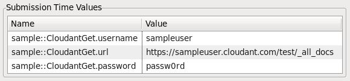
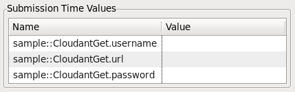

---

copyright:
  years: 2015, 2020
lastupdated: "2020-09-22"

subcollection: StreamingAnalytics

---

<!-- Attribute definitions -->
{:new_window: target="_blank"}
{:shortdesc: .shortdesc}
{:codeblock: .codeblock}
{:screen: .screen}
{:note: .note}

# Integrating with Cloudant and other RESTful services
{: #integrate_cloudant}

Streams integrates with other technologies using adapters to popular protocols such as TCP, ODBC, Kafka, JMS, MQTT and HDFS, just to name a few. REST is another established protocol that is gaining popularity because of its use in many cloud-based services. This article describes how to use Streams HTTP adapters to integrate SPL applications to Cloudant and other RESTful, web-based services.

## Prerequisites
{: #prereqs}

The Streams plugins for Microsoft VS Code. Follow the steps under **install and set up** in [this guide](http://ibmstreams.github.io/streamsx.documentation/docs/spl/quick-start/qs-1b/).

Download the latest release of the [Inet Toolkit](https://github.com/IBMStreams/streamsx.inet) on GitHub.

[Add the toolkit as a dependency](https://ibmstreams.github.io/streamsx.documentation/docs/spl/quick-start/qs-3/#how-do-i-add-a-toolkit-as-a-dependency) to VS Code.

Download the [Streams Integration Samples project](https://ibm.biz/StreamsIntegrationSamples) and add the CloudantGet and CloudantPost samples to your Visual Studio workspace.

## Setting up Cloudant
{: #setup}

### Getting connection information
{: #getting_connection_information}

Create a Cloudant account on [cloudant.com](https://cloudant.com/), or create a [Cloudant service on IBM Cloud](https://cloud.ibm.com/catalog/services/cloudant). When creating the service on IBM Cloud,  make sure you scroll to the bottom to the **Authentication** section and select the dropdown option for **IAM and legacy credentials.**

After creating the service instance, you need to get the following information from the dashboard.

- username
- password
- host

The host is _[username].cloudant.com_, or, if you created the service through IBM Cloud, the username can be found on the “Service Credentials” tab of the IBM Cloud service dashboard.

To get credentials, open your instance of the Cloudant service from the IBM Cloud dashboard.

* Navigate to the **Service credentials** tab of the Cloudant service dashboard.  
* Click **New Credential** and then **Add**.  
* Click the **Copy to clipboard** icon in the right side of the new credential row that appeared.  
* Paste the clipboard contents to a text document on your computer for later steps.  
* Note the “url”, “username”, and “password” fields.

### Creating a Cloudant database
{: #create_cloudant_database}

Navigate to the Cloudant dashboard by logging in to [cloudant.com](http://cloudant.com/) or pressing **Launch Cloudant Dashboard** from the **Manage** tab of the Cloudant service dashboard.

Click **Create Database** in the top right corner. Follow the prompts to name and create the database named “test”. An empty database will be created.

To view the contents of the database, click the database name link in the table of the “Databases” tab, and select “All Documents”.

## Using Cloudant’s REST API
{: #use_cloudant_api}

### Putting documents into Cloudant
{: #put_documents_in_cloudant}

Import the `CloudantPost` sample application into your workspace and launch it using your Cloudant credentials. The URL is **https://[username].cloudant.com/test.**

If you created the Cloudant database with IBM Cloud:

- the URL is the URL from the credentials with “/test” appended,
- and the username and password are the username and password fields from the credentials you copied earlier.

For more information on Submission Time Values, see [this article.](https://www.ibm.com/support/knowledgecenter/SSCRJU_4.3.0/com.ibm.streams.dev.doc/doc/submissionvalues.html)

This Streams application will create a new Cloudant document containing the string “Cloudant” every two seconds. For each document, the console will print “errorMessage: Created”, along with some other JSON metadata. Let the application run for a few seconds and then cancel the Streams job.

If the request was not successful, a few things might have happened:

- The console printed a JSON error response. You successfully connected to Cloudant, but some error occurred after that point. The “reason” field gives some hints about what went wrong.
- If the console printed a non-JSON error or exception, you have not successfully connected to Cloudant. Double check the URL for accuracy.
- See [“Troubleshooting unsuccessful requests”](/docs/StreamingAnalytics?topic=StreamingAnalytics-integrate_cloudant#troubleshooting)

Upon success, new documents have been added to Cloudant. Head back to the “All Documents” view to see them.

To view the data inside a document, select the “pencil” icon on the top-right corner of the dark-colored “document box”.

You should see the document that you just created.

Note that the CloudantPost sample application’s first operator is a Beacon that activates the HTTPPost and gives it the message body data. To change the frequency or number of requests, use the Beacon’s period or iterations parameters. However, the HTTPPost operator can connect with any stream carrying an rstring parameter named “message”.

### Listing all documents in Cloudant
{: #list_documents_in_cloudant}

Now that we can create documents, we want to access them from the REST API. Launch CloudantGet with the same values, except change the URL to **[username].cloudant.com/test/_all_docs** .

This Streams application will output the contents of the Cloudant database every two seconds.

While CloudantGet is running, you can run CloudantPost at the same time and watch the database grow from CloudantGet’s console output.

For more information on Cloudant’s REST API, see the [Cloudant API reference overview ](/docs/Cloudant?topic=Cloudant-api-reference-overview).

## Using other REST APIs from SPL
{: #use_other_rest_apis}

### Making a GET request
{: #make_get_request}

Using REST APIs, streams applications can integrate with nearly any web-based RESTful service.  You may use the provided samples to work with other services.

To make a GET request to any RESTful service, you need the following information from the service:

- URL to retrieve the resource
- User name to connect to the service
- Password to connect to the service
- Any other service-specific information

Import the CloudantGet project into your workspace. Launch the application, and specify submission time values based on the information you have collected from the service.

If the request was successful, the result will be printed to the console. If unsuccessful, an exception will display instead (see [“Troubleshooting unsuccessful requests”](/docs/StreamingAnalytics?topic=StreamingAnalytics-integrate_cloudant#troubleshooting)).

### Making a POST request
{: #make_post_request}

Similarly, to send a post request to a RESTful service, you need to provide URL, username, and password of the service.

In Streams Studio, import CloudantPost project into the workspace.  Build and launch the application using the appropriate values for the service.

You may need to modify some parameters of the sample’s HTTP operators in order to integrate with different services.

## Troubleshooting unsuccessful requests
{: #troubleshooting}

- Revisit the service’s REST API instructions. The service may expect information that wasn’t included in the request.
- Some REST APIs require fields not supported by Streams operators. In this case, waiting for an appropriate toolkit update may be necessary

