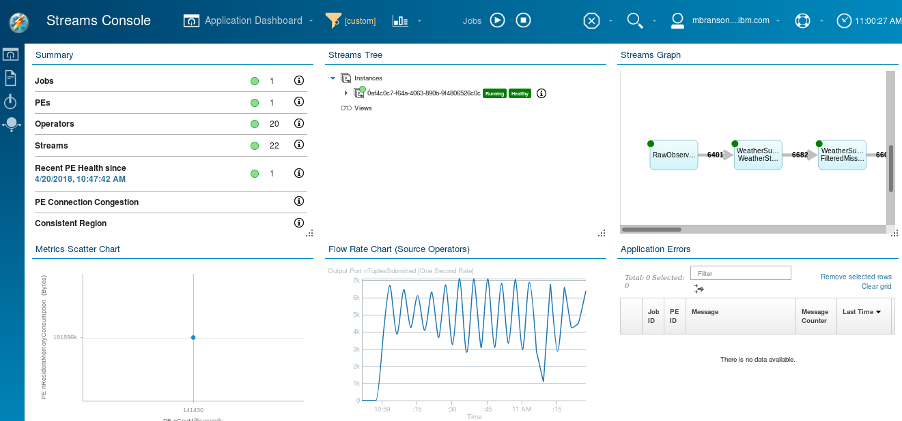
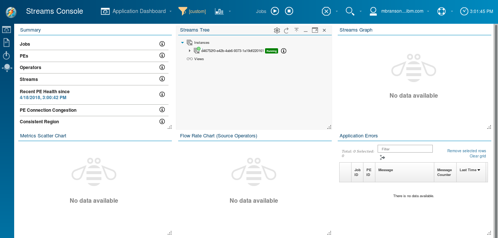
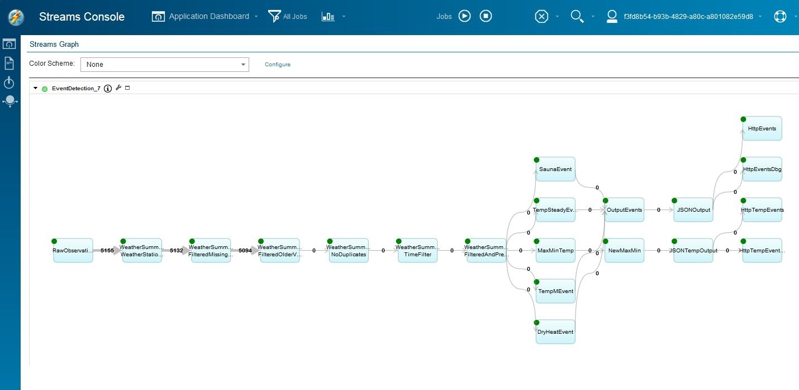

---

copyright:
  years: 2015, 2020
lastupdated: "2020-07-28"

subcollection: StreamingAnalytics

---

<!-- Attribute definitions -->
{:new_window: target="_blank"}
{:shortdesc: .shortdesc}
{:codeblock: .codeblock}
{:screen: .screen}
{:pre: .pre}
{:tip: .tip}
{:note: .note}
{:video: .video}

# Using the Streaming Analytics Service
{: #using_streaming_analytics}

There are two ways that you can use your Streaming Analytics instance:

- Interactively – through the Streaming Analytics console
- Programmatically – through the Streaming Analytics REST API

You can also combine the two usage methods.  For example, you could submit Streams applications through the REST API and explore the running applications using the Streams console.

### Interactive Approach – Using the Streams Console

You can launch the Streams console from the Streaming Analytics instance, and submit applications to your instance from the console.  You may also explore, monitor, and control your running applications from the console.  To access the Streams Console, perform the following steps:

1.  Bring up the Streaming Analytics service dashboard by clicking on the tile in the IBM Cloud web portal associated with your instance.
2.  Click on the LAUNCH button to launch the Streams console.

This version of the Streams Console is specifically tailored for the Cloud environment.  The Application Dashboard view gives you an overview of your Streams instance.  It shows a summary of all of the jobs and PEs that are running on the instance.  From the dashboard, you can see status and performance information, live application graphs, tuples rates, and a wide variety of other information about your instance and applications.

Below is the initial view of the Streams Console, just as it would appear after you launch it from the service dashboard for your new instance.

The Streams Console can be used to submit a Streams application to your instance in the cloud.  Select the “play” icon from the top menu bar to submit a job.

When submitting a job, you are prompted to identify a Streams Application Bundle (.sab file) to upload and submit to your Streams instance.  Below, a .sab file is chosen for an application that was developed locally on a laptop using the Streams Quick Start Edition.  (The Streaming Analytics service requires you to develop your Streams application in a Streams environment.  If you don’t already have a Streams environment where you can develop and test applications, the Streams Quick Start Edition provides a full Streams environment, free-of-charge.  See the [Streaming Analytics Development Guide](https://developer.ibm.com/streamsdev/docs/development-guide-choice/) for instructions on downloading and setting up the Streams Quick Start Edition.)

After identifying the Streams Application Bundle, click Configure.

On the next page, specify any submission time parameters required by your application or any other submission configuration information. Click Submit to deploy the application to your Streams instance.

In addition to submitting applications, the console can be used to explore and manage your applications.  For example, the Streams graph for the instance in the cloud is shown below, displaying the live status of the application in the form of a flow graph.

### Putting it all together:  Deploy a starter application

  This short video demonstrates the features and concepts just discussed.  You can follow along simply by downloading the sample application and submitting it to the service, no coding required!

[Download the application](https://github.com/IBMStreams/samples/releases/download/20170322_release/StockTradesStarterApp.sab), and then watch the video. It shows how to:

- Create an instance of the Streaming Analytics Service (00:22)
- Run the [starter application](https://github.com/IBMStreams/samples/releases/download/20170322_release/StockTradesStarterApp.sab) in the service (00:56)
- See the actual data being processed by an application  (02:13)
- Look at the applications logs and any data printed to stdout/stderr  (03:17)

{: video output="iframe" data-script="none" id="getstartedplayer" frameborder="0" webkitallowfullscreen mozallowfullscreen allowfullscreen}

### Programmatic Approach – Using the Streaming Analytics REST API

The Streaming Analytics service provides a REST API to allow IBM Cloud applications to interact with a Streams instance programmatically.  The API provides several operations allowing an application to submit Streams application bundles, control the instance, query statuses, etc.  See the [Streaming Analytics documentation in IBM Cloud](https://www.ng.bluemix.net/docs/services/StreamingAnalytics/index.html#r_restapi?cm_sp=dw-bluemix-_-streamsdev-_-devcenter) to view detailed information about its REST API.

Starter applications have been provided as working examples of how to use the Streaming Analytics REST API.  See the [Event Detection starter application tutorial](https://developer.ibm.com/streamsdev/docs/detect-events-with-streams/) for an exmaple of how to use the Streaming Analytics service programatically through its REST API.

## Additional Information

- [Roadmap for Streaming Analytics Service on IBM Cloud](/docs/StreamingAnalytics?topic=StreamingAnalytics-roadmap)

